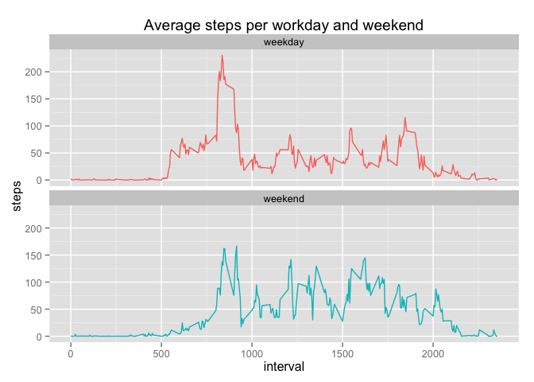

# Reproducible Research: Peer Assessment 1


## Loading and preprocessing the data

Lets load the data and take a quick look on it

```r
library(ggplot2)

data <- read.csv(unz("activity.zip", "activity.csv"))
#data = read.csv('activity.csv')
data$date <- as.Date(data$date, "%Y-%m-%d")

head(data)
```

```
##   steps       date interval
## 1    NA 2012-10-01        0
## 2    NA 2012-10-01        5
## 3    NA 2012-10-01       10
## 4    NA 2012-10-01       15
## 5    NA 2012-10-01       20
## 6    NA 2012-10-01       25
```

```r
str(data)
```

```
## 'data.frame':	17568 obs. of  3 variables:
##  $ steps   : int  NA NA NA NA NA NA NA NA NA NA ...
##  $ date    : Date, format: "2012-10-01" "2012-10-01" ...
##  $ interval: int  0 5 10 15 20 25 30 35 40 45 ...
```

## What is mean total number of steps taken per day?
Histogram of the total number of steps taken each day:

```r
daily_steps <- aggregate(steps ~ date, data=data, FUN=sum)
with(daily_steps, hist(steps))
```

 

Calculating the **mean** and **median** total number of steps taken per day

```r
day_mean <- mean(daily_steps$steps)
day_median <- median(daily_steps$steps, na.rm=T)
```
Mean total number of steps taken per day is 10766.19 with median 10765.


## What is the average daily activity pattern?

To visualize the pattern, we'll aggregate steps by period first and then make a plot

```r
activity_pattern <- aggregate(steps ~ interval, data = data, FUN = mean)
with(activity_pattern, plot(x=interval, y=steps, type="l", main="Daily activity pattern"))
```

 

Finding 5-minute interval, on average across all the days in the dataset, contains the maximum number of steps

```r
activity_pattern[which.max(activity_pattern$steps), ]
```

```
##     interval    steps
## 104      835 206.1698
```

## Imputing missing values


```r
missing_values <- sum(is.na(data$steps))
```
Lets imput the missing values. As an NA replacement, we'll take the data from averaged steps per corresponding interval and round it.

```r
data_imput <- data
missing_steps <- which(is.na(data_imput$steps))
for (i in missing_steps) {
  interval <- data_imput[i, 'interval']
  steps <- activity_pattern[activity_pattern$interval == interval, 'steps']
  data_imput[i, 'steps'] <- steps
}
```

Total number of missing values in the dataset is 2304 out of 17568 records.

Histogram of the total number of steps taken each day:

```r
daily_steps_imput <- aggregate(steps ~ date, data=data_imput, FUN=sum)
with(daily_steps_imput, hist(steps))
```

 

Using data with imputed value, lets calculate the **mean** and **median** total number of steps taken per day

```r
day_mean_imput <- mean(daily_steps_imput$steps)
day_median_imput <- median(daily_steps_imput$steps, na.rm=T)
```
Mean total number of steps taken per day, according to data with imputed values is 10766.19 with median 10766.19, compated to original data with missing values - 
10766.19 with median 10765.


## Are there differences in activity patterns between weekdays and weekends?


```r
data_imput$dayofweek <- factor(ifelse(weekdays(data_imput$date) %in% c('Sunday','Saturday'), 'weekend', 'weekday'))
steps_dayofweek <- aggregate(steps ~ interval + dayofweek, data=data_imput, FUN=mean)
qplot(x=interval, y=steps, color=dayofweek, data=steps_dayofweek, geom='line', main="Average steps per workday and weekend") + facet_wrap( ~ dayofweek, ncol = 1) + theme(legend.position="none")
```

 
